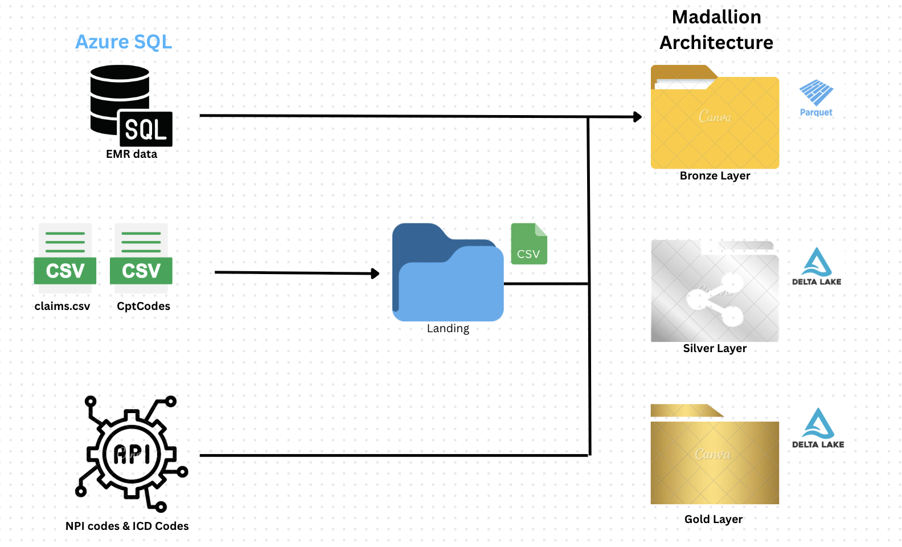

# Healthcare Revenue Cycle Management (RCM) - Data Engineering Project

This project presents a metadata-driven, modular data engineering pipeline using Azure Data Engineering Stack. It supports end-to-end ingestion, transformation, and modeling of Healthcare Revenue Cycle Management data using Medallion Architecture and Delta Lake.

The solution delivers cleaned, governed, and analytics-ready datasets to track KPIs like Accounts Receivable Days, aging buckets, and claim processing efficiency, enabling better financial outcomes for healthcare providers.

## Business Problem
RCM is the process of managing the financial lifecycle of a patient encounter—from scheduling to final payment. Delays in collections and claim denials hurt hospital cash flows.

Key goals:
* Improve collection turnaround.
* Track aged AR (e.g., >90 days).
* Benchmark performance (e.g., 93% collections within 30 days vs. 73% in 90).

## Solution Architecture: Medallion + Metadata-Driven

| Layer       | Format  | Purpose                                              |
| ----------- | ------- | ---------------------------------------------------- |
| Landing     | CSV     | Raw insurance claims, CPT codes from file drops      |
| Bronze      | Parquet | Immutable source-of-truth from SQL/API/files         |
| Silver      | Delta   | Cleaned, standardized data (CDM + SCD2)              |
| Gold        | Delta   | Final fact and dimension tables for BI and analytics |

Fully metadata-driven using load_config.csv
Supports both full and incremental loads with watermark
Audit logging for data traceability
Dynamic ingestion pipelines using ADF Lookup, Filter, ForEach

## Project Architecture Diagram

## Technology Stack

| Service                        | Purpose                                                      |
| ------------------------------ | ------------------------------------------------------------ |
| Azure Data Factory             | Ingestion orchestration, dynamic pipelines via config files  |
| Azure SQL Database             | EMR source system (patients, encounters, transactions)       |
| Azure Data Lake Gen2           | Multi-layered storage for Landing → Bronze → Silver → Gold   |
| Azure Databricks               | PySpark notebooks for SCD2, CDM, Quality Checks              |
| Delta Lake                     | Silver and Gold layer storage for ACID compliance            |
| Azure Key Vault                | Secrets and credential management                            |
| Unity Catalog (Databricks)     | Central metadata management and multi-workspace table access |

## Data Sources & Formats

| Source           | Format / Protocol | Notes                                                      |
| ---------------- | ----------------- | ---------------------------------------------------------- |
| EMR (SQL DB)     | ADF > JDBC        | Patients, Providers, Transactions, Departments, Encounters |
| Claims           | CSV (Landing)     | Monthly insurance dumps (hospital A, B)                    |
| CPT Codes        | CSV (Landing)     | Procedure codes                                            |
| NPI Codes        | REST API          | National Provider Identifier                               |
| ICD Codes        | REST API          | Diagnosis classification                                   |

## Data Modeling Strategy

### Common Data Model (CDM)
* Harmonizes schema from multiple hospitals (e.g., HOSA, HOSB)
* Merges different field names using UNION ALL

### Slowly Changing Dimensions (SCD Type 2)
* Applies to: Patients, Transactions, Encounters, Claims, ICD/NPI/CPT
* Tracks history using: inserted_date, modified_date, is_current
* Implemented via Delta Merge in Databricks

### Quality Checks (Silver Layer)
* Null validation using CASE statements
* Records failing checks are flagged as is_quarantined = true

## Key Components

### Metadata-Driven Pipeline (ADF)
* Config File: /configs/emr/load_config.csv
* Fields: database, tablename, loadtype, watermark, is_active
* Pipeline dynamically ingests tables from SQL based on is_active=1

### Audit Logging (Delta Table)
* Captures data_source, table_name, rows_copied, load_date
* Ensures traceability for both full and incremental loads

## Key Features & Enhancements
* Parallel pipeline execution via ADF concurrency
* Retry logic for transient failures
* Key Vault integration for secure Linked Services
* Unity Catalog for cross-workspace table access
* Clean folder and naming standards
* Format differentiation per layer
  * Bronze: Parquet
  * Silver/Gold: Delta Tables
  * Landing: CSV

## Final Gold Layer Outputs

| Fact Tables        | Dimension Tables                              |
| ------------------ | --------------------------------------------- |
| fact_transaction   | dim_patient, dim_provider, dim_icd_code       |
|                    | dim_department, dim_cpt_code, dim_npi         |

## Gold Layer Schema Diagram

## Outcomes
* Production-ready, scalable RCM data platform
* Supports BI, reporting, machine learning
* Demonstrates advanced Azure skills: ADF, Databricks, Delta, Key Vault, CDM

